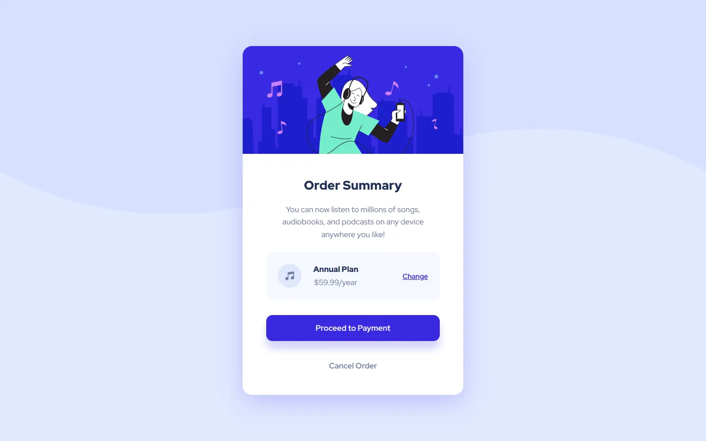

# Frontend Mentor - Order summary card solution

This is a solution to the [Order summary card challenge on Frontend Mentor](https://www.frontendmentor.io/challenges/order-summary-component-QlPmajDUj). Frontend Mentor challenges help you improve your coding skills by building realistic projects.

## Screenshot

## Links

- Solution URL:
- Live Site URL: https://agizmaylov.github.io/frontend-mentor-order-summary-component/
- All solutions: https://agizmaylov.github.io/frontend-mentor-solutions/

## Built with

- Semantic HTML5 markup
- CSS custom properties
- Flexbox
- Fluid typography
